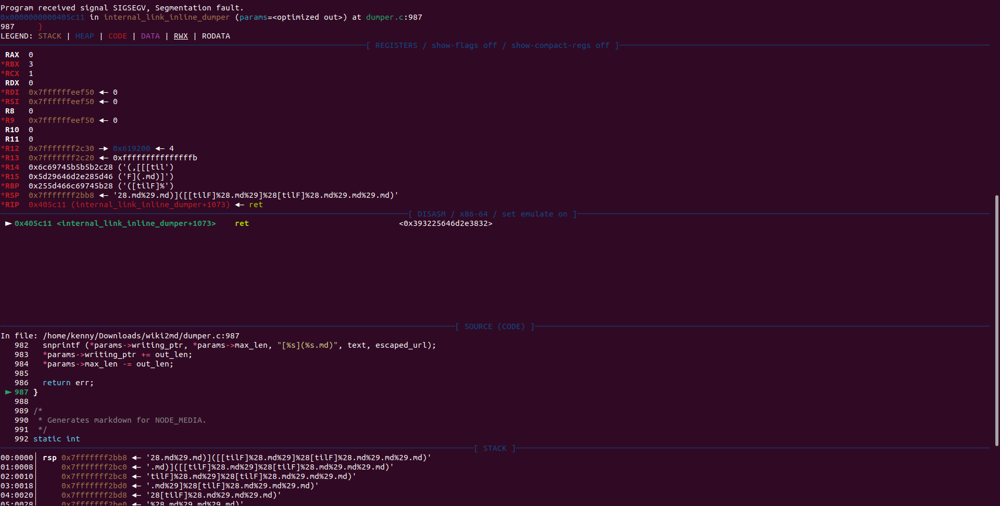
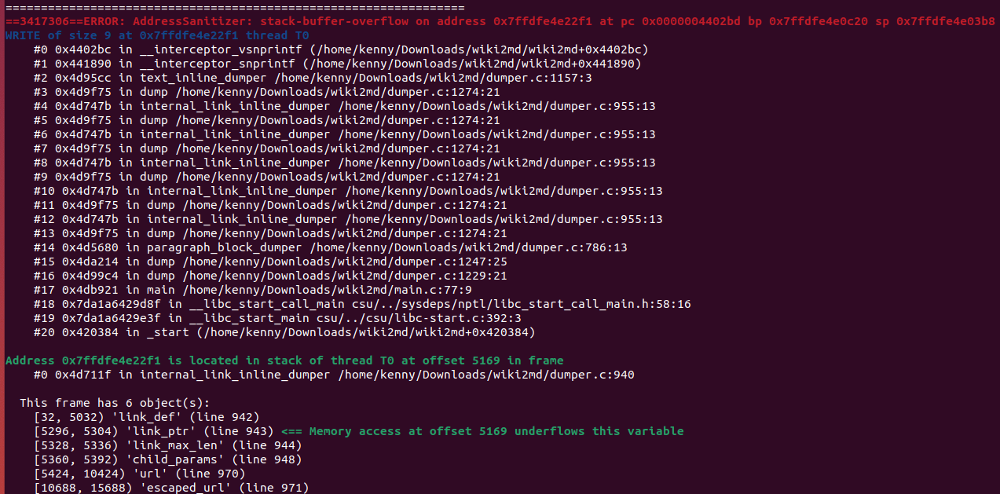

# Description of CVE-2024-xxxx
A stack buffer overflow vulnerability was found in internal/external_link_inline_dumper functions of wiki2md 1.0.0. The vulnerability allows an attacker to overwrite the stack buffer, potentially leading to arbitrary code execution or denial of service.

# CVE-2024-xxxx
I discovered a vulnerability in wiki2md in the function internal_link_inline_dumper of dumper.c. C programs are often susceptible to memory corruption vulnerabilities which can be exploited for malicious purposes. Writing secure C code requires careful attention to detail. One way to find memory corruption vulnerability is called "fuzz testing".

Fuzz testing is a software testing methodology where a program is supplied with invalid or random data with the intent of revealing or finding vulnerabilities and bugs. This program is used to convert mediawiki syntax docs to markdown format. During the fuzzing process, I discovered a stack based buffer overflow in internal_link_inline_dumper. 

## Finding the Crash Out!
Install wiki2md and compile the program.
```
git clone https://github.com/oelmekki/wiki2md
cd wiki2md
make
```

run the program with the proof of concept wiki input.

```
./wiki2md poc.wiki
```

You will receive a segfault and the program will crash.

### Identifying vuln
If you attach GDB to the program and run with the malicious input. We can see the registers being overwritten by our input. Note that the return pointer was also overwritten.



This is most likely a stack based buffer overflow but let's modify the makefile with ASAN to confirm the vulnerability. 

Add -fsanitize=address -g to our flags and rerun the program with the poc input.

We should receive an output that confirms a buffer overflow vulnerability.




## Source Code Analysis
```c
*
 * Generates markdown for NODE_INTERNAL_LINK.
 *
 * More parsing is done here to match the various components
 * of the links.
 */
static int
internal_link_inline_dumper (dumping_params_t *params)
{
  int err = 0;
  char link_def[MAX_LINK_LENGTH] = {0};
  char *link_ptr = link_def;
  size_t link_max_len = MAX_LINK_LENGTH;

  for (size_t i = 0; i < params->node->children_len; i++)
    {
      dumping_params_t child_params = {
        .node = params->node->children[i],
        .writing_ptr = &link_ptr,
        .start_of_buffer = params->start_of_buffer,
        .max_len = &link_max_len,
      };

      err = dump (&child_params);
      if (err)
        {
          fprintf (stderr, "dumper.c : internal_link_inline_dumper() : error while processing link content.\n");
          return 1;
        }
    }

  if (strlen (link_def) == 0)
    {
      fprintf (stderr, "dumper.c : internal_link_inline_dumper() : warning : empty link detected.\n");
      snprintf (link_def, 15, "redlink");
    }

  char *text = strstr (link_def, "|");
  char url[MAX_LINK_LENGTH] = {0};
  char escaped_url[MAX_LINK_LENGTH] = {0};
  snprintf (url, (text ? (size_t) (text - link_def) : strlen (link_def)) + 1, "%s", link_def);
  escape_url_for_markdown (url, escaped_url);

  if (text)
    text++;

  if (!text || !strlen (text))
    text = url;

  size_t out_len = strlen (text) + strlen (escaped_url) + 7;
  snprintf (*params->writing_ptr, *params->max_len, "[%s](%s.md)", text, escaped_url);
  *params->writing_ptr += out_len;
  *params->max_len -= out_len;

  return err;
}
```

Looking at the code, link_ptr is initialized to point to link_def array. This means any writes to link_ptr will affect the link_def array. The snprintf call is attempting to write a formatted string to the memory location pointed to by params->writing_ptr which is derived from link_ptr. 

The formatted string being written by snprintf is longer than the space allocated for link_def. This happens because text or escaped_url variables being inserted into the format string are longer than expected.


